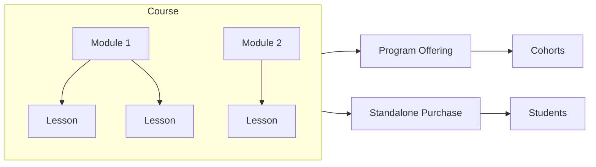

Courses are reusable learning units in First Responders Hub. Each course has a title, description, estimated hours, and completion rules. You build a course once, then assign it to program offerings (so enrolled students get access) and optionally sell it as a standalone product.

## What's in this section

| Guide | What it covers |
|-------|----------------|
| [Creating and managing courses](/courses/creating-and-managing) | Creating a course, editing settings (title, description, prerequisites), and when to use the course builder versus course settings |
| [Structure: modules and lessons](/courses/structure-modules-lessons) | Organizing content into modules and lessons, reordering, and marking required |
| [Content and media](/courses/content-and-media) | Adding lesson content: videos (upload and URLs), text, PDFs, embeds, and resources |
| [Assigning to program offerings](/courses/assigning-to-offerings) | Attaching courses to an offering so cohorts get access; order and required flag |
| [Sessions and lessons](/courses/sessions-and-lessons) | Assigning lessons to specific cohort sessions on the schedule |
| [Standalone courses](/courses/standalone-courses) | Selling a course without enrollment: visibility, pricing, public page, and purchases |

## High-level flow

1. **Create a course** — From the Courses list, use **Create Course** (title and description). You are taken to the course builder.
2. **Build structure** — Add modules, then lessons inside each module. Reorder as needed.
3. **Add content** — Open each lesson in the lesson editor and add content (e.g. upload videos, add text or links).
4. **Assign and/or sell** — Assign the course to one or more [program offerings](/courses/assigning-to-offerings) so enrolled students see it. Optionally enable [standalone purchase](/courses/standalone-courses) so anyone can buy the course.

## Where to find Courses

Go to [**Program Dashboard → Courses**](https://www.firstrespondershub.com/program-dashboard/courses) to:

- See all courses for your organization
- Create a new course
- Open a course to edit its settings or go to the course builder (structure and content)
- Delete a course (if not in use)

From a course you can open the **Course Builder** to manage modules and lessons, or **Edit Course Settings** to change title, description, estimated hours, completion threshold, prerequisite course, and standalone sale options.
