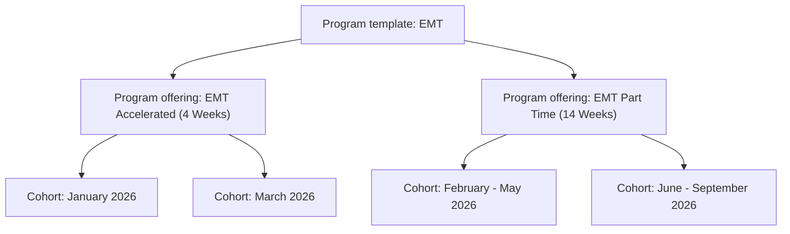

Welcome to the First Responders Hub documentation. This guide introduces the core concepts and terminology used on the platform so your organization can get the most out of managing programs, cohorts, enrollments, and students.

## Quick reference

| Term | Description |
|------|-------------|
| [Organization](#organization) | Training provider entity; has locations and program offerings |
| [Location](#location) | Physical or virtual place where training occurs |
| [Program template](#program-template) | Platform-level program type (e.g. EMT, Paramedic); you create offerings from it |
| [Program offering](#program-offering) | Your version of a program; recurring (weeks/months) or single-day event |
| [Cohort](#cohort) | A specific run of an offering with dates and capacity |
| [Cohort lifecycle](#cohort-lifecycle) | States: Planning → Open → Full/In progress → Completed/Archived |
| [Session](#session) | Single class meeting within a cohort (lecture, lab, exam) |
| [Modality](#modality) | Delivery: in-person, virtual, or hybrid |
| [Enrollment](#enrollment) | A student’s place in a cohort and its status |
| [Application forms](#application-forms) | Custom forms attached to offerings (before or after enrollment) |
| [Enrollment agreements](#enrollment-agreements) | Terms/waivers students must accept during enrollment |
| [Roles](#roles) | Program owner, Instructor, Student, Sponsor |
| [How it fits together](#how-it-fits-together) | Diagram: organization → offerings → cohorts → sessions & enrollments |

## Core concepts

### Organization

Your **organization** is the training provider entity on the platform. It has a name, contact details, description, and one or more locations and program offerings.

### Location

A **location** is a physical or virtual place where training occurs. Organizations can have multiple locations. Each location has an address (or virtual designation), timezone, and can host sessions for your cohorts.

### Program template

A **program template** is a standardized program type defined at the platform level—for example, EMT-Basic, Paramedic, or Firefighter I/II. It describes the credential type, accreditation body, industry category (e.g. EMT, paramedic, fire, basic healthcare), and typical duration. Your organization does not create templates; you create **program offerings** that implement a template. If a program template you need is not available, please reach out to support and we will add it.

**Example:** EMT.

### Program offering

A **program offering** is your organization’s version of a program. You define its name, description, delivery modality (in-person, virtual, or hybrid), schedule types, tuition, default capacity, and which locations it uses. Each offering can have multiple **cohorts** (specific runs with dates and capacity). Application forms and enrollment agreements are attached at the offering level. Offerings can be **recurring** (programs with classes over weeks or months, e.g. an EMT course) or **events** (single-day workshops or classes).

**Example:** EMT Accelerated (4 Weeks) and EMT Part Time (14 Weeks).

### Cohort

A **cohort** is a specific run of a program offering—for example, “Fall 2025 EMT Class” or “Spring 2026 Paramedic.” It has start and end dates, enrollment capacity, enrollment deadline, and a **lifecycle state**. Students enroll in a cohort, not directly in the offering.

**Example:** For EMT Accelerated (4 Weeks)—January 2026, March 2026. For EMT Part Time (14 Weeks)—February – May 2026, June – September 2026.

### Cohort lifecycle

A cohort moves through these states:

- **Planning** — Being set up; not yet open for enrollment.  
- **Open** — Accepting enrollments (and optionally waitlist).  
- **Waitlist open** — Not taking new enrollments but collecting waitlist sign-ups.  
- **Full** — At capacity; no new enrollments (waitlist may still be available).  
- **In progress** — Class has started.  
- **Completed** — Class has ended.  
- **Archived** — Retained for records only.  

### Session

A **session** is a single class meeting within a cohort—e.g. a lecture, lab, exam, or skills practice. Sessions have start and end times, can be tied to a location (or virtual link), and together form the cohort’s schedule.

### Modality

**Modality** describes how a program is delivered:

- **In-person** — Training occurs at a physical location.  
- **Virtual** — Training is fully online.  
- **Hybrid** — Mix of in-person and virtual.  

### Enrollment

An **enrollment** is a student’s place in a cohort. Each enrollment has a status, such as:

- **Enrolled** — Active student in the cohort.  
- **Completed** — Finished the program.  
- **Paid pending application** — Payment received; awaiting required post-enrollment form(s).  
- **Withdrawn** — Student withdrew.  
- **Dropped** — Student was dropped.  
- **Failed** — Did not complete successfully.  

### Application forms

**Application forms** are custom forms you attach to program offerings. They can be required **before** enrollment (e.g. background or certification info) or **after** enrollment (e.g. post-payment paperwork). Some forms require organization approval before the student can complete checkout.

### Enrollment agreements

**Enrollment agreements** are terms, waivers, or policies (e.g. liability, code of conduct) that students must accept during enrollment. You create and manage them at the organization level and assign which agreements are required per program offering. Acceptance is recorded for compliance.

### Roles

- **Program owner** — Full access to manage the organization’s offerings, cohorts, applications, enrollments, agreements, and settings.  
- **Instructor** — Typically limited access to cohorts and students they teach (e.g. attendance, outcomes).  
- **Student** — Someone who enrolls in cohorts and uses the student dashboard.  
- **Sponsor** — A third party (e.g. employer) that can pay for a student’s enrollment.  

## How it fits together

Organizations have locations and program offerings. Each offering implements a program template and has cohorts. Cohorts have sessions and enrollments. Application forms and enrollment agreements are configured per offering.

## Need help?

For support or questions about the platform, contact your Customer Success team or use the [First Responders Hub dashboard](https://dashboard.mintlify.com/firstraespondershub/firstrespondershub).
